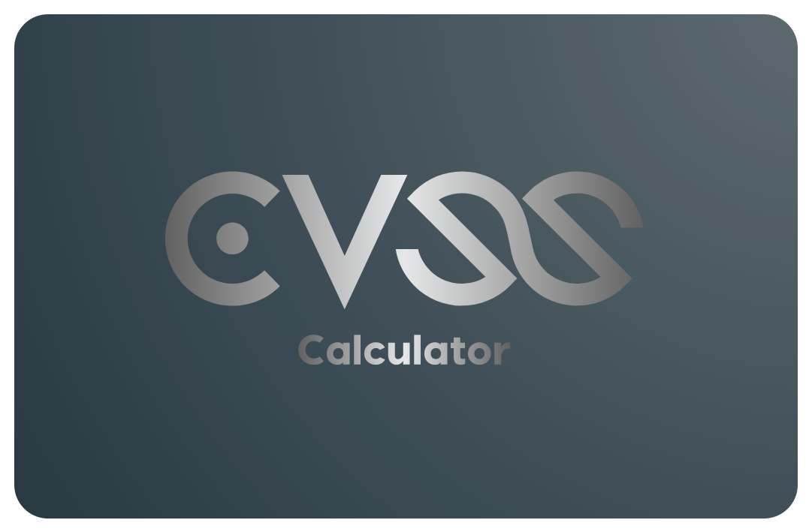

<!-- PROJECT LOGO -->
 

  

<h1 align="center">CVSS Calculator</h1>

<!-- TABLE OF CONTENTS -->

  
Table of Contents

  <ol>
    <li>
      <a href="#about-the-project">About The Project</a>
      <ul>
        <li><a href="#built-with">Built With</a></li>
        <li><a href="#tested-on">Tested On</a></li>
      </ul>
    </li>
    <li><a href="#getting-started">Getting Started</a></li>
    <li><a href="#usage">Usage</a></li>
    <li><a href="#roadmap">Roadmap</a></li>
    <li><a href="#contributing">Contributing</a></li>
    <li><a href="#contact">Contact</a></li>
    <li><a href="#notes">Notes</a></li>
    <li><a href="#acknowledgments">Acknowledgments</a></li>
  </ol>

<!-- ABOUT THE PROJECT -->
## About The Project

CVSS Calculator is a portable Windows application that's designed to be run from the TaskBar to quickly calculate CVSS 3.1 scores.
 
 
The calculator at <a href="https://www.first.org/cvss/calculator/3.1">First.org</a> is a great resource, but often at times I've wished I didn't need to load up yet another page to do it - this is where the app comes in.
 
 
I've designed the app to mimic the look and feel of the web version, so that people are already familiar with it.

(<a href="#readme-top">back to top</a>)

### Built With

[![C#][C#]][C#-url] [![xaml][Xaml]][Xaml-url] [![.NET][.NET]][.NET-url]

The app in its current state is targetted at .NET 6.0, using MVVM architecture (for the most part), and is built on the Windows Presentation Framework (WPF).
The UI is written in XAML and the application logic is written in C#.

(<a href="#readme-top">back to top</a>)

### Tested On

![WindowsXI-shield] ![WindowsX-shield]

(<a href="#readme-top">back to top</a>)

<!-- GETTING STARTED -->
## Getting Started

1) Download the latest version from <a href="https://github.com/TheD4rkSide/CVSSCalculator/releases">releases</a> and extract the contents.
2) Run CVSSCalculator.exe

(<a href="#readme-top">back to top</a>)

<!-- USAGE -->
## Usage

(<a href="#readme-top">back to top</a>)

<!-- ROADMAP -->
## Roadmap

- [ ] Low/Medium/High/Critical Text
- [ ] Environmental Metrics
- [ ] CVSS Score Saving
- [ ] Custom Colour Styling
- [ ] Code Signing/EV Code Certificate

(<a href="#readme-top">back to top</a>)

<!-- CONTRIBUTING -->
## Contributing

Contributions are what make the open source community such an amazing place to learn, inspire others, and collaborate to create great products and solutions. Any contributions you make **really** are appreciated.

If you have a suggestion that would make this better, please fork the repo and create a pull request. You can also simply open an issue with the tag "enhancement".
Don't forget to give the project a star! Thanks again!

1. Fork the Project
2. Create your Feature Branch (`git checkout -b feature/AmazingFeature`)
3. Commit your Changes (`git commit -m 'Add some AmazingFeature'`)
4. Push to the Branch (`git push origin feature/AmazingFeature`)
5. Open a Pull Request

(<a href="#readme-top">back to top</a>)

<!-- CONTACT -->
## Contact

[![LinkedIn][linkedin-shield]][linkedin-url] [![Outlook-shield]][Outlook-url]

Project Link: [CVSS Calculator](https://github.com/TheD4rkSide/CVSSCalculator)

(<a href="#readme-top">back to top</a>)

<!-- NOTES -->
## Notes
SmartScreen might give you a warning that the app is untrusted. That's normal behaviour because I need to generate some funds to get the code signed and a certificate issued (It's on the roadmap).

(<a href="#readme-top">back to top</a>)

<!-- ACKNOWLEDGMENTS -->
## Acknowledgments
This is my first venture into MVVM architecture, and whilst I'm sure it's not perfect, I feel special thanks are owed to a few people on one of the Discord servers I'm part of for keeping me on the right path.
* Re_fresh_
* Foe
* keyl
* nohopestage

(<a href="#readme-top">back to top</a>)

<!-- MARKDOWN LINKS & IMAGES -->

[product-screenshot]: images/screenshot.png
[linkedin-shield]: https://img.shields.io/badge/-LinkedIn-black.svg?style=for-the-badge&logo=linkedin&colorB=blue
[linkedin-url]: https://linkedin.com/in/reece-alqotaibi-82719b142?t
[C#]: https://img.shields.io/badge/C%23-9238e0?style=for-the-badge&logo=c-sharp&logoColor=white
[C#-url]: https://learn.microsoft.com/en-us/dotnet/csharp/
[.NET]: https://img.shields.io/badge/.NET-5C2D91?style=for-the-badge&logo=.net&logoColor=white
[.NET-url]: https://learn.microsoft.com/en-us/dotnet/desktop/wpf/xaml/
[Xaml]: https://img.shields.io/static/v1?style=for-the-badge&message=XAML&color=0C54C2&logo=XAML&logoColor=FFFFFF&label=
[Xaml-url]: https://learn.microsoft.com/en-us/dotnet/desktop/wpf/xaml/?view=netdesktop-6.0
[WindowsX-shield]:https://img.shields.io/static/v1?style=for-the-badge&message=Windows%2010&color=0078D6&logo=Windows&logoColor=FFFFFF&label=
[WindowsXI-shield]: https://img.shields.io/static/v1?style=for-the-badge&message=Windows+11&color=4e00d6&logo=Windows+11&logoColor=FFFFFF&label=
[Outlook-shield]: https://img.shields.io/badge/Email-737874?style=for-the-badge&logo=microsoft-outlook
[Outlook-url]: mailto:github@alqotaibi.com?subject=[GitHub]%20CVSS%20Calculator
